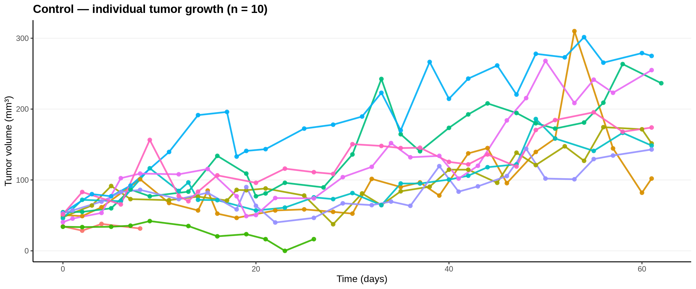
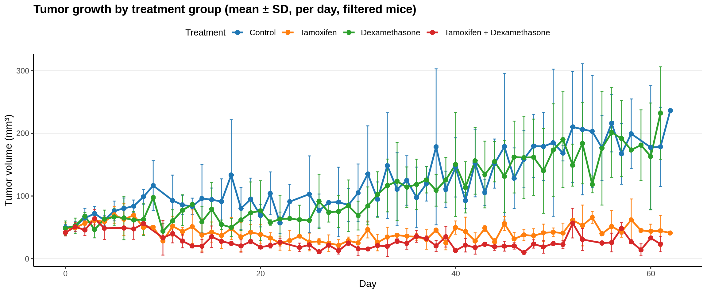
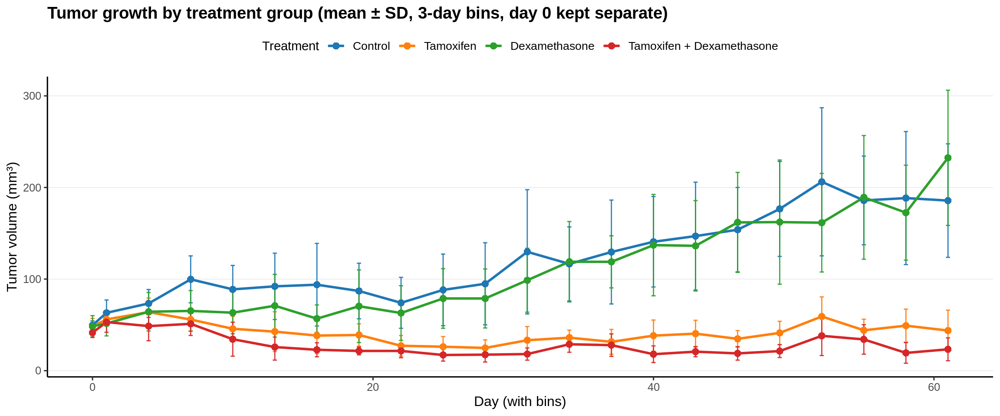
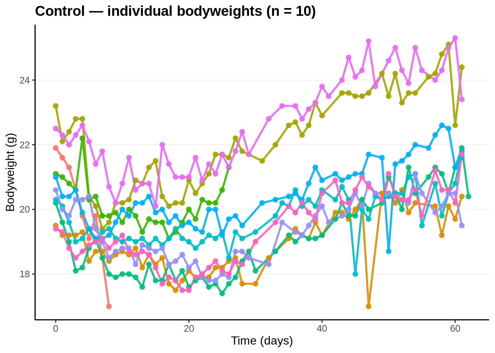
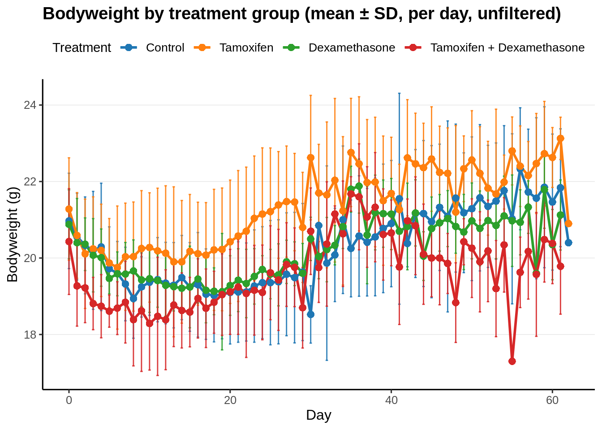
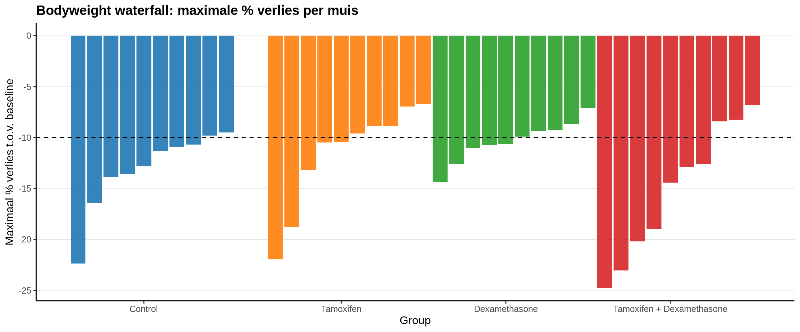
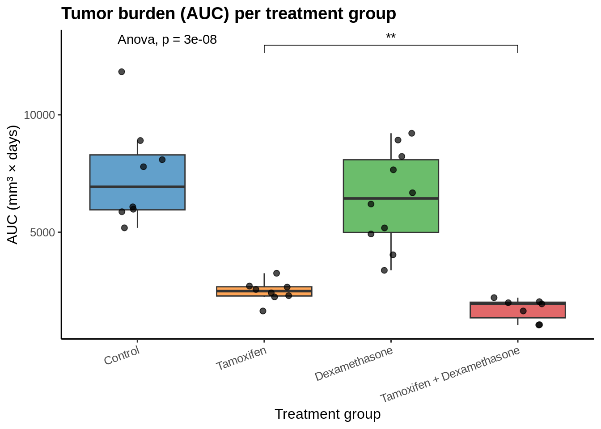

# Tumor & Bodyweight Analysis with QC and Filtering

This repository documents a complete workflow for analyzing tumor growth and bodyweight in mice treated with different compounds.  
The analysis is performed in **R Markdown**, combining code, results, and interpretation into a reproducible report.

---

## 1. Introduction

Preclinical experiments often follow tumor growth and bodyweight over time in different treatment groups.  
To ensure robust and interpretable results, raw data needs to be:

- Loaded and mapped into tidy formats,  
- Checked for quality (minimum number of measurements, unrealistic values, etc.),  
- Filtered according to QC criteria,  
- Summarized at both the **mouse level** and the **group level**,  
- Visualized with growth curves and error bars,  
- Analyzed statistically (ANOVA, t-tests, etc.).

This workflow automates all of those steps.

---

## 2. Data Sources

Two Excel files are used:

- **Tumor volume data** (`*_tumor_mouse_and_group_means.xlsx`)
- **Bodyweight data** (`*_bodyweight_mouse_and_group_means.xlsx`)

Both contain daily mean values per mouse.

Treatment groups are mapped as:

- Control  
- Tamoxifen  
- Dexamethasone  
- Tamoxifen + Dexamethasone  

Colors are consistently applied in all plots.

---

## 3. Tumor Analysis

### 3.1 Loading Data
Tumor volume data is loaded from the `Mouse_day_mean` sheet and reshaped into a long format with:

- `group_name` (treatment group)  
- `mouse_id` (unique mouse identifier)  
- `day` (time point)  
- `volume_mm3` (tumor volume in mm³)

A preview of the first rows:

*(table: Preview tumor per mouse per day — generated in the HTML report)*

---

### 3.2 Quality Check (QC)
Each mouse is checked for:

- Number of recorded time points (`n_points`)  
- Minimum and maximum day recorded  
- First, last, min, and max tumor volumes  
- Whether the mouse should be **excluded** (fewer than 4 points or min volume ≤ 0)

QC summary per mouse:

*(table: Simplified tumor QC table — included in HTML report)*

---

### 3.3 Individual Growth Curves
Tumor growth per mouse, grouped by treatment:



---

### 3.4 Filtering by Duration
Mice with <30 days of follow-up are excluded.

*(table: Duration per mouse, with “excluded = TRUE” for short follow-up)*

---

### 3.5 Group Means ± SD

#### Per day (no binning):


#### Binned (3-day bins, day 0 kept separate):


---

## 4. Bodyweight Analysis

### 4.1 Loading Data
Bodyweight data is read from the same Excel workbook, selecting the correct column (`mean_bodyweight_g` or `bodyweight_g`).

Preview:

*(table: Preview bodyweight per mouse per day — generated in HTML report)*

---

### 4.2 Individual Bodyweight Curves


---

### 4.3 Group Means ± SD
Mean ± SD bodyweight per group over time:



---

### 4.4 Maximum % Loss (Waterfall)
For each mouse:

- Baseline = day 0 (if available) or first measurement,  
- % change calculated relative to baseline,  
- Minimum % retained across time = nadir.

Plotted as a waterfall:



Dashed line marks a −10% threshold.

---

## 5. Tumor Burden (AUC) + Statistics

### 5.1 Area Under the Curve (AUC)
For each mouse:

- Tumor volume vs. day curve integrated (trapezoidal rule).  
- Produces per-mouse tumor burden.

*(table: Preview AUC per mouse — in HTML report)*

---

### 5.2 Statistical Testing
- **ANOVA**: tests for overall group differences  
- **Pairwise t-tests** (Holm correction): compare treatment pairs  
- **Tukey HSD**: post-hoc analysis

*(tables: Tukey post-hoc results and summary of AUC per group — included in HTML report)*

---

### 5.3 Visualization
Boxplots of AUC per treatment group with p-values:



---

## 6. Reproducibility

### Running the Analysis

1. Clone the repository:
   ```bash
   git clone https://github.com/<your-username>/<your-repo>.git

