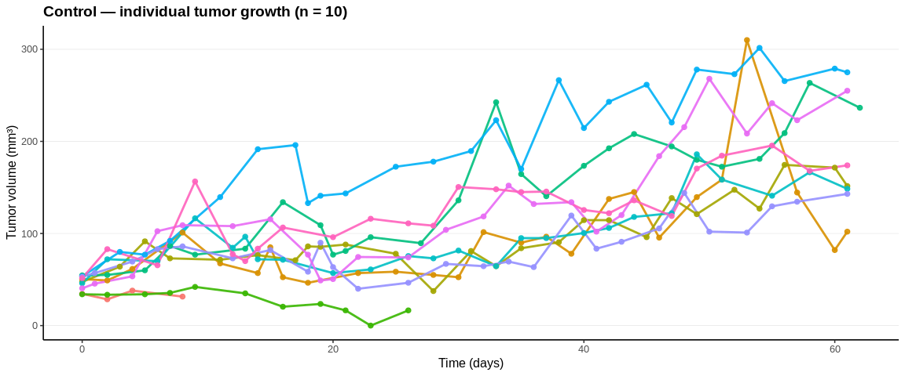
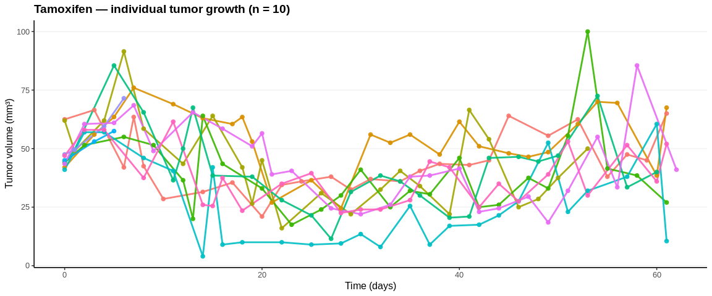
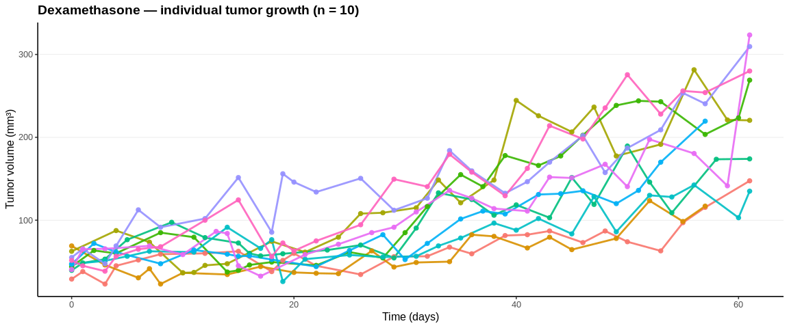
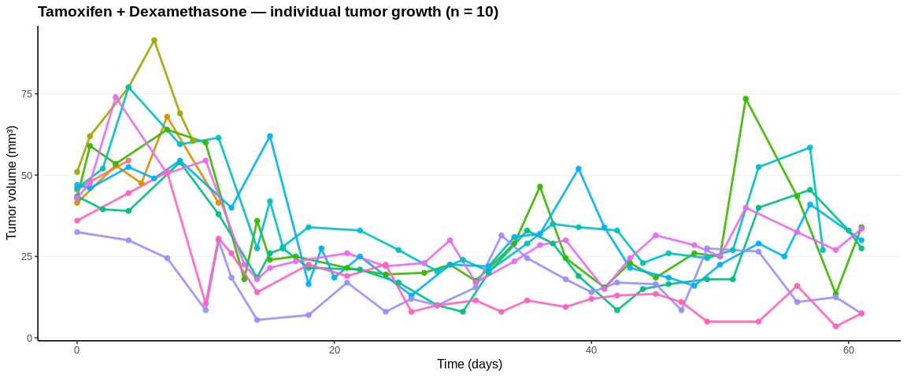
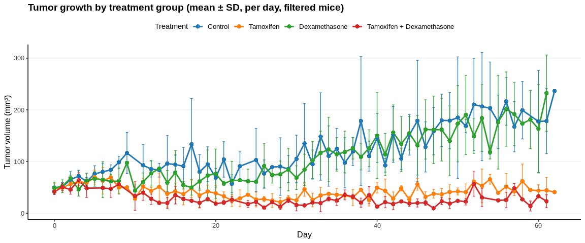
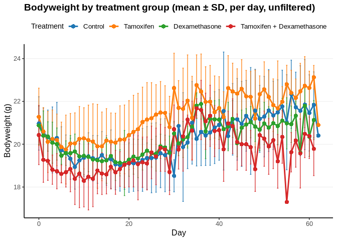
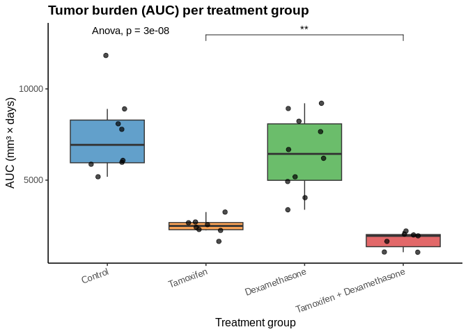

11636_Data analysis
================
Filip Noijons
2025-09-09

- [Setup](#setup)
- [Tumor analysis](#tumor-analysis)
  - [Shared mapping & helpers](#shared-mapping--helpers)
  - [Tumor: data loading](#tumor-data-loading)
  - [Tumor: data quality check](#tumor-data-quality-check)
  - [Tumor growth per mouse](#tumor-growth-per-mouse)
  - [Exclude mice with \< 30 days](#exclude-mice-with--30-days)
  - [Tumor group mean ± SD (Per day, no binning, filtered
    mice)](#tumor-group-mean--sd-per-day-no-binning-filtered-mice)
  - [Tumor group mean ± SD (Binned, filtered
    mice)](#tumor-group-mean--sd-binned-filtered-mice)
- [Bodyweight analysis](#bodyweight-analysis)
  - [Bodyweight per mouse](#bodyweight-per-mouse)
- [Bodyweight analysis (unfiltered
  mice)](#bodyweight-analysis-unfiltered-mice)
  - [Load bodyweight data](#load-bodyweight-data)
  - [Bodyweight per mouse](#bodyweight-per-mouse-1)
  - [Bodyweight group mean ± SD (per day,
    unfiltered)](#bodyweight-group-mean--sd-per-day-unfiltered)
  - [Bodyweight waterfall: maximale % verlies per
    muis](#bodyweight-waterfall-maximale--verlies-per-muis)
  - [Tumor: AUC per mouse +
    ANOVA/T-tests](#tumor-auc-per-mouse--anovat-tests)

# Setup

# Tumor analysis

## Shared mapping & helpers

``` r
group_name_map <- c(
  `11636.1` = "Control",
  `11636.2` = "Tamoxifen",
  `11636.3` = "Dexamethasone",
  `11636.4` = "Tamoxifen + Dexamethasone"
)

pal <- c(
  "Control"                   = "#1f77b4",
  "Tamoxifen"                 = "#ff7f0e",
  "Dexamethasone"             = "#2ca02c",
  "Tamoxifen + Dexamethasone" = "#d62728"
)

bin_day_keep0 <- function(day, width = 3L, anchor = 1L, label = c("start","center")) {
  label <- match.arg(label)
  base <- anchor + width * floor((day - anchor)/width)
  base <- ifelse(day <= 0, 0L, base)
  if (label == "center") {
    base <- ifelse(day <= 0, 0L, base + floor((width - 1L)/2L))
  }
  as.integer(base)
}
```

## Tumor: data loading

``` r
mouse_df <- readxl::read_excel(tumor_file, sheet = "Mouse_day_mean") %>%
  dplyr::mutate(
    group_code = as.character(group_code),
    group_name = factor(unname(group_name_map[group_code]), levels = names(pal)),
    day        = as.numeric(day),
    mouse_id   = as.character(mouse_id),
    volume_mm3 = as.numeric(mean_volume_mm3)
  ) %>%
  dplyr::filter(group_code %in% names(group_name_map)) %>%
  dplyr::arrange(group_name, mouse_id, day)

knitr::kable(head(mouse_df, 8),
             caption="Preview: tumor per mouse per day",
             format="markdown")
```

| group_code | mouse_id | day | mean_volume_mm3 | group_name | volume_mm3 |
|:-----------|:---------|----:|----------------:|:-----------|-----------:|
| 11636.1    | 2539021  |   0 |            34.5 | Control    |       34.5 |
| 11636.1    | 2539021  |   2 |            28.5 | Control    |       28.5 |
| 11636.1    | 2539021  |   4 |            38.0 | Control    |       38.0 |
| 11636.1    | 2539021  |   8 |            31.5 | Control    |       31.5 |
| 11636.1    | 2539023  |   0 |            50.5 | Control    |       50.5 |
| 11636.1    | 2539023  |   2 |            49.0 | Control    |       49.0 |
| 11636.1    | 2539023  |   4 |            61.5 | Control    |       61.5 |
| 11636.1    | 2539023  |   8 |           101.0 | Control    |      101.0 |

Preview: tumor per mouse per day

## Tumor: data quality check

``` r
min_points_required  <- 4

tum_qc <- mouse_df %>%
  group_by(group_code, group_name, mouse_id) %>%
  arrange(day, .by_group = TRUE) %>%
  summarise(
    n_points   = n(),
    min_day    = min(day, na.rm = TRUE),
    max_day    = max(day, na.rm = TRUE),
    first_vol  = first(volume_mm3),
    last_vol   = last(volume_mm3),
    min_vol    = min(volume_mm3, na.rm = TRUE),
    max_vol    = max(volume_mm3, na.rm = TRUE),
    .groups    = "drop"
  ) %>%
  mutate(
    recommend_exclude = (n_points < min_points_required) | (min_vol <= 0)
  ) %>%
  arrange(group_code, mouse_id)

knitr::kable(tum_qc,
             caption = "Simplified tumor QC table per mouse",
             format="markdown")
```

| group_code | group_name | mouse_id | n_points | min_day | max_day | first_vol | last_vol | min_vol | max_vol | recommend_exclude |
|:---|:---|:---|---:|---:|---:|---:|---:|---:|---:|:---|
| 11636.1 | Control | 2539021 | 4 | 0 | 8 | 34.5 | 31.5 | 28.5 | 38.0 | FALSE |
| 11636.1 | Control | 2539023 | 26 | 0 | 61 | 50.5 | 102.0 | 46.5 | 310.0 | FALSE |
| 11636.1 | Control | 2539027 | 26 | 0 | 61 | 47.5 | 151.5 | 37.5 | 174.5 | FALSE |
| 11636.1 | Control | 2539034 | 11 | 0 | 26 | 34.0 | 16.5 | 0.0 | 42.0 | TRUE |
| 11636.1 | Control | 2539039 | 26 | 0 | 62 | 54.5 | 236.5 | 54.5 | 263.5 | FALSE |
| 11636.1 | Control | 2539045 | 25 | 0 | 61 | 46.0 | 148.5 | 46.0 | 186.0 | FALSE |
| 11636.1 | Control | 2539047 | 26 | 0 | 61 | 53.5 | 275.0 | 53.5 | 301.5 | FALSE |
| 11636.1 | Control | 2539050 | 26 | 0 | 61 | 53.0 | 143.0 | 40.0 | 144.0 | FALSE |
| 11636.1 | Control | 2539052 | 26 | 0 | 61 | 40.5 | 255.0 | 40.5 | 268.0 | FALSE |
| 11636.1 | Control | 2539057 | 25 | 0 | 61 | 51.5 | 174.0 | 51.5 | 195.5 | FALSE |
| 11636.2 | Tamoxifen | 2539020 | 26 | 0 | 61 | 62.5 | 65.0 | 21.0 | 66.5 | FALSE |
| 11636.2 | Tamoxifen | 2539026 | 26 | 0 | 61 | 42.0 | 67.5 | 24.5 | 76.0 | FALSE |
| 11636.2 | Tamoxifen | 2539028 | 23 | 0 | 53 | 62.0 | 50.0 | 16.0 | 91.5 | FALSE |
| 11636.2 | Tamoxifen | 2539035 | 26 | 0 | 61 | 44.0 | 27.0 | 17.5 | 100.0 | FALSE |
| 11636.2 | Tamoxifen | 2539036 | 25 | 0 | 60 | 44.0 | 40.0 | 11.5 | 85.5 | FALSE |
| 11636.2 | Tamoxifen | 2539043 | 26 | 0 | 61 | 41.0 | 10.5 | 4.0 | 60.5 | FALSE |
| 11636.2 | Tamoxifen | 2539046 | 3 | 0 | 5 | 45.0 | 57.5 | 45.0 | 57.5 | TRUE |
| 11636.2 | Tamoxifen | 2539048 | 4 | 0 | 6 | 47.5 | 71.5 | 47.5 | 71.5 | FALSE |
| 11636.2 | Tamoxifen | 2539053 | 26 | 0 | 62 | 43.5 | 41.0 | 18.5 | 85.5 | FALSE |
| 11636.2 | Tamoxifen | 2539058 | 26 | 0 | 61 | 47.0 | 52.0 | 22.5 | 61.5 | FALSE |
| 11636.3 | Dexamethasone | 2539024 | 27 | 0 | 61 | 29.0 | 147.5 | 23.0 | 147.5 | FALSE |
| 11636.3 | Dexamethasone | 2539029 | 24 | 0 | 57 | 69.0 | 117.0 | 23.0 | 123.5 | FALSE |
| 11636.3 | Dexamethasone | 2539031 | 25 | 0 | 61 | 62.5 | 220.5 | 36.5 | 281.5 | FALSE |
| 11636.3 | Dexamethasone | 2539032 | 26 | 0 | 61 | 44.0 | 269.0 | 37.5 | 269.0 | FALSE |
| 11636.3 | Dexamethasone | 2539033 | 26 | 0 | 61 | 39.5 | 174.0 | 39.5 | 189.5 | FALSE |
| 11636.3 | Dexamethasone | 2539040 | 26 | 0 | 61 | 47.0 | 135.0 | 26.0 | 142.5 | FALSE |
| 11636.3 | Dexamethasone | 2539042 | 24 | 0 | 57 | 47.0 | 219.5 | 44.0 | 219.5 | FALSE |
| 11636.3 | Dexamethasone | 2539044 | 27 | 0 | 61 | 55.0 | 309.5 | 47.5 | 309.5 | FALSE |
| 11636.3 | Dexamethasone | 2539051 | 26 | 0 | 61 | 40.5 | 323.5 | 32.5 | 323.5 | FALSE |
| 11636.3 | Dexamethasone | 2539056 | 27 | 0 | 61 | 51.5 | 280.0 | 38.5 | 280.0 | FALSE |
| 11636.4 | Tamoxifen + Dexamethasone | 2539019 | 3 | 0 | 4 | 45.5 | 54.5 | 45.5 | 54.5 | TRUE |
| 11636.4 | Tamoxifen + Dexamethasone | 2539022 | 5 | 0 | 11 | 41.5 | 41.5 | 41.5 | 68.0 | FALSE |
| 11636.4 | Tamoxifen + Dexamethasone | 2539025 | 6 | 0 | 9 | 51.0 | 60.5 | 51.0 | 91.5 | FALSE |
| 11636.4 | Tamoxifen + Dexamethasone | 2539030 | 26 | 0 | 61 | 43.0 | 34.0 | 13.5 | 73.5 | FALSE |
| 11636.4 | Tamoxifen + Dexamethasone | 2539037 | 26 | 0 | 61 | 43.5 | 27.5 | 8.0 | 54.0 | FALSE |
| 11636.4 | Tamoxifen + Dexamethasone | 2539038 | 25 | 0 | 58 | 46.0 | 27.0 | 20.5 | 77.0 | FALSE |
| 11636.4 | Tamoxifen + Dexamethasone | 2539041 | 26 | 0 | 61 | 47.0 | 30.0 | 13.0 | 62.0 | FALSE |
| 11636.4 | Tamoxifen + Dexamethasone | 2539049 | 25 | 0 | 61 | 32.5 | 7.5 | 5.5 | 32.5 | FALSE |
| 11636.4 | Tamoxifen + Dexamethasone | 2539054 | 26 | 0 | 61 | 43.0 | 33.5 | 15.0 | 74.0 | FALSE |
| 11636.4 | Tamoxifen + Dexamethasone | 2539055 | 25 | 0 | 61 | 36.0 | 7.5 | 3.5 | 51.0 | FALSE |

Simplified tumor QC table per mouse

## Tumor growth per mouse

``` r
# Plot function for each treatment group separately
plot_group_mice <- function(df_group, title_text) {
  ggplot(df_group, aes(x = day, y = volume_mm3, group = mouse_id, color = mouse_id)) +
    geom_line(linewidth = 1, alpha = 0.9) +
    geom_point(size = 2, alpha = 0.9) +
    scale_color_discrete(guide = "none") +
    labs(
      title = title_text,
      x = "Time (days)",
      y = "Tumor volume (mm³)"
    ) +
    theme_classic(base_size = 12) +
    theme(
      plot.title = element_text(face = "bold"),
      panel.grid.major.y = element_line(color = "grey90", linewidth = 0.25),
      panel.grid.minor.y = element_blank()
    )
}

# Loop over groups and print separate plots
for (g in levels(mouse_df$group_name)) {
  sub <- dplyr::filter(mouse_df, group_name == g)
  n_m <- dplyr::n_distinct(sub$mouse_id)
  ttl <- paste0(g, " — individual tumor growth (n = ", n_m, ")")
  print(plot_group_mice(sub, ttl))
}
```

<!-- --><!-- --><!-- --><!-- -->

## Exclude mice with \< 30 days

``` r
min_duration_days <- 30

duration_summary <- mouse_df %>%
  group_by(group_code, group_name, mouse_id) %>%
  summarise(
    min_day = min(day, na.rm = TRUE),
    max_day = max(day, na.rm = TRUE),
    duration_days = max_day - min_day,
    .groups = "drop"
  )

exclude_ids <- duration_summary %>%
  filter(duration_days < min_duration_days) %>%
  pull(mouse_id)

mouse_df_filtered <- mouse_df %>%
  filter(!mouse_id %in% exclude_ids)

knitr::kable(
  duration_summary %>%
    mutate(excluded = duration_days < min_duration_days),
  caption = paste("Mice with duration <", min_duration_days, "days are excluded")
)
```

| group_code | group_name | mouse_id | min_day | max_day | duration_days | excluded |
|:---|:---|:---|---:|---:|---:|:---|
| 11636.1 | Control | 2539021 | 0 | 8 | 8 | TRUE |
| 11636.1 | Control | 2539023 | 0 | 61 | 61 | FALSE |
| 11636.1 | Control | 2539027 | 0 | 61 | 61 | FALSE |
| 11636.1 | Control | 2539034 | 0 | 26 | 26 | TRUE |
| 11636.1 | Control | 2539039 | 0 | 62 | 62 | FALSE |
| 11636.1 | Control | 2539045 | 0 | 61 | 61 | FALSE |
| 11636.1 | Control | 2539047 | 0 | 61 | 61 | FALSE |
| 11636.1 | Control | 2539050 | 0 | 61 | 61 | FALSE |
| 11636.1 | Control | 2539052 | 0 | 61 | 61 | FALSE |
| 11636.1 | Control | 2539057 | 0 | 61 | 61 | FALSE |
| 11636.2 | Tamoxifen | 2539020 | 0 | 61 | 61 | FALSE |
| 11636.2 | Tamoxifen | 2539026 | 0 | 61 | 61 | FALSE |
| 11636.2 | Tamoxifen | 2539028 | 0 | 53 | 53 | FALSE |
| 11636.2 | Tamoxifen | 2539035 | 0 | 61 | 61 | FALSE |
| 11636.2 | Tamoxifen | 2539036 | 0 | 60 | 60 | FALSE |
| 11636.2 | Tamoxifen | 2539043 | 0 | 61 | 61 | FALSE |
| 11636.2 | Tamoxifen | 2539046 | 0 | 5 | 5 | TRUE |
| 11636.2 | Tamoxifen | 2539048 | 0 | 6 | 6 | TRUE |
| 11636.2 | Tamoxifen | 2539053 | 0 | 62 | 62 | FALSE |
| 11636.2 | Tamoxifen | 2539058 | 0 | 61 | 61 | FALSE |
| 11636.3 | Dexamethasone | 2539024 | 0 | 61 | 61 | FALSE |
| 11636.3 | Dexamethasone | 2539029 | 0 | 57 | 57 | FALSE |
| 11636.3 | Dexamethasone | 2539031 | 0 | 61 | 61 | FALSE |
| 11636.3 | Dexamethasone | 2539032 | 0 | 61 | 61 | FALSE |
| 11636.3 | Dexamethasone | 2539033 | 0 | 61 | 61 | FALSE |
| 11636.3 | Dexamethasone | 2539040 | 0 | 61 | 61 | FALSE |
| 11636.3 | Dexamethasone | 2539042 | 0 | 57 | 57 | FALSE |
| 11636.3 | Dexamethasone | 2539044 | 0 | 61 | 61 | FALSE |
| 11636.3 | Dexamethasone | 2539051 | 0 | 61 | 61 | FALSE |
| 11636.3 | Dexamethasone | 2539056 | 0 | 61 | 61 | FALSE |
| 11636.4 | Tamoxifen + Dexamethasone | 2539019 | 0 | 4 | 4 | TRUE |
| 11636.4 | Tamoxifen + Dexamethasone | 2539022 | 0 | 11 | 11 | TRUE |
| 11636.4 | Tamoxifen + Dexamethasone | 2539025 | 0 | 9 | 9 | TRUE |
| 11636.4 | Tamoxifen + Dexamethasone | 2539030 | 0 | 61 | 61 | FALSE |
| 11636.4 | Tamoxifen + Dexamethasone | 2539037 | 0 | 61 | 61 | FALSE |
| 11636.4 | Tamoxifen + Dexamethasone | 2539038 | 0 | 58 | 58 | FALSE |
| 11636.4 | Tamoxifen + Dexamethasone | 2539041 | 0 | 61 | 61 | FALSE |
| 11636.4 | Tamoxifen + Dexamethasone | 2539049 | 0 | 61 | 61 | FALSE |
| 11636.4 | Tamoxifen + Dexamethasone | 2539054 | 0 | 61 | 61 | FALSE |
| 11636.4 | Tamoxifen + Dexamethasone | 2539055 | 0 | 61 | 61 | FALSE |

Mice with duration \< 30 days are excluded

## Tumor group mean ± SD (Per day, no binning, filtered mice)

``` r
tumor_daily <- mouse_df_filtered %>%
  group_by(group_code, group_name, day) %>%
  summarise(
    mean_volume_mm3 = mean(volume_mm3, na.rm = TRUE),
    sd_mm3          = sd(volume_mm3, na.rm = TRUE),
    n_mice          = n(),
    .groups = "drop"
  ) %>%
  arrange(group_name, day)

ggplot(tumor_daily, aes(x = day, y = mean_volume_mm3,
                        color = group_name, group = group_name)) +
  geom_errorbar(aes(ymin = mean_volume_mm3 - sd_mm3,
                    ymax = mean_volume_mm3 + sd_mm3),
                width = 0.3, alpha = 0.9) +
  geom_line(linewidth = 1.0) +
  geom_point(size = 2.6, shape = 16) +
  scale_color_manual(values = pal, breaks = names(pal), name = "Treatment") +
  labs(
    title = "Tumor growth by treatment group (mean ± SD, per day, filtered mice)",
    x = "Day",
    y = "Tumor volume (mm³)"
  ) +
  theme_classic(base_size = 12) +
  theme(
    legend.position = "top",
    legend.title    = element_text(size = 11),
    legend.text     = element_text(size = 10),
    plot.title      = element_text(face = "bold"),
    panel.grid.major.y = element_line(color = "grey90", linewidth = 0.25),
    panel.grid.minor.y = element_blank()
  )
```

<!-- -->

## Tumor group mean ± SD (Binned, filtered mice)

``` r
# Custom binning function:
# - keep day 0 separate
# - bin 1–2 as 1, 3–5 as 3, etc.
bin_day_custom <- function(day, width = 3L, anchor = 1L, label = "start") {
  if (day == 0) return(0L)
  label <- match.arg(label, choices = c("start", "center"))
  base <- anchor + width * floor((day - anchor)/width)
  if (label == "center") base <- base + floor((width - 1L)/2L)
  as.integer(base)
}

tumor_binned <- mouse_df_filtered %>%
  mutate(bin_day = vapply(day, bin_day_custom,
                          integer(1), width = bin_width,
                          anchor = bin_anchor,
                          label = bin_label)) %>%
  group_by(group_code, group_name, bin_day) %>%
  summarise(
    mean_volume_mm3 = mean(volume_mm3, na.rm = TRUE),
    sd_mm3          = sd(volume_mm3, na.rm = TRUE),
    n_mice          = n(),
    .groups = "drop"
  ) %>%
  arrange(group_name, bin_day)

ggplot(tumor_binned, aes(x = bin_day, y = mean_volume_mm3,
                         color = group_name, group = group_name)) +
  geom_errorbar(aes(ymin = mean_volume_mm3 - sd_mm3,
                    ymax = mean_volume_mm3 + sd_mm3),
                width = 0.3, alpha = 0.9) +
  geom_line(linewidth = 1.0) +
  geom_point(size = 2.6, shape = 16) +
  scale_color_manual(values = pal, breaks = names(pal), name = "Treatment") +
  labs(
    title = paste0("Tumor growth by treatment group (mean ± SD, ",
                   bin_width, "-day bins, day 0 kept separate)"),
    x = "Day (with bins)",
    y = "Tumor volume (mm³)"
  ) +
  theme_classic(base_size = 12) +
  theme(
    legend.position = "top",
    legend.title    = element_text(size = 11),
    legend.text     = element_text(size = 10),
    plot.title      = element_text(face = "bold"),
    panel.grid.major.y = element_line(color = "grey90", linewidth = 0.25),
    panel.grid.minor.y = element_blank()
  )
```

<!-- -->

# Bodyweight analysis

## Bodyweight per mouse

# Bodyweight analysis (unfiltered mice)

## Load bodyweight data

``` r
bw_raw <- readxl::read_excel(bw_file, sheet = "Mouse_day_mean")

# Detect correct bodyweight column
bw_candidates <- c("mean_bodyweight_g", "bodyweight_g")
bw_col <- bw_candidates[bw_candidates %in% names(bw_raw)][1]
if (is.na(bw_col)) stop("No bodyweight column found in Mouse_day_mean")

bw_mouse <- bw_raw %>%
  mutate(
    group_code   = as.character(group_code),
    group_name   = factor(unname(group_name_map[group_code]), levels = names(pal)),
    day          = as.numeric(day),
    mouse_id     = as.character(mouse_id),
    bodyweight_g = .data[[bw_col]]
  ) %>%
  filter(group_code %in% names(group_name_map)) %>%
  arrange(group_name, mouse_id, day)

knitr::kable(head(bw_mouse, 8),
             caption="Preview: bodyweight per mouse per day",
             format="markdown")
```

| group_code | group_name | mouse_id | day | bodyweight_g |
|:-----------|:-----------|:---------|----:|-------------:|
| 11636.1    | Control    | 2539021  |   0 |         21.9 |
| 11636.1    | Control    | 2539021  |   1 |         21.6 |
| 11636.1    | Control    | 2539021  |   2 |         21.3 |
| 11636.1    | Control    | 2539021  |   3 |         20.6 |
| 11636.1    | Control    | 2539021  |   4 |         19.8 |
| 11636.1    | Control    | 2539021  |   5 |         19.1 |
| 11636.1    | Control    | 2539021  |   6 |         19.8 |
| 11636.1    | Control    | 2539021  |   7 |         18.5 |

Preview: bodyweight per mouse per day

## Bodyweight per mouse

``` r
plot_bw_group <- function(df_group, title_text) {
  ggplot(df_group, aes(x = day, y = bodyweight_g,
                       group = mouse_id, color = mouse_id)) +
    geom_line(linewidth = 1, alpha = 0.9) +
    geom_point(size = 2, alpha = 0.9) +
    scale_color_discrete(guide = "none") +
    labs(
      title = title_text,
      x = "Time (days)",
      y = "Bodyweight (g)"
    ) +
    theme_classic(base_size = 12) +
    theme(
      plot.title = element_text(face = "bold"),
      panel.grid.major.y = element_line(color = "grey90", linewidth = 0.25),
      panel.grid.minor.y = element_blank()
    )
}

for (g in levels(bw_mouse$group_name)) {
  sub <- filter(bw_mouse, group_name == g)
  n_m <- n_distinct(sub$mouse_id)
  ttl <- paste0(g, " — individual bodyweights (n = ", n_m, ")")
  print(plot_bw_group(sub, ttl))
}
```

<!-- --><!-- --><!-- --><!-- -->

## Bodyweight group mean ± SD (per day, unfiltered)

``` r
bw_daily <- bw_mouse %>%
  group_by(group_name, day) %>%
  summarise(
    mean_bw = mean(bodyweight_g, na.rm = TRUE),
    sd_bw   = sd(bodyweight_g, na.rm = TRUE),
    n       = n(),
    .groups = "drop"
  ) %>%
  arrange(group_name, day)

ggplot(bw_daily, aes(x = day, y = mean_bw,
                     color = group_name, group = group_name)) +
  geom_errorbar(aes(ymin = mean_bw - sd_bw, ymax = mean_bw + sd_bw),
                width = 0.3, alpha = 0.9) +
  geom_line(linewidth = 1.0) +
  geom_point(size = 2.6, shape = 16) +
  scale_color_manual(values = pal, breaks = names(pal), name = "Treatment") +
  labs(
    title = "Bodyweight by treatment group (mean ± SD, per day, unfiltered)",
    x = "Day",
    y = "Bodyweight (g)"
  ) +
  theme_classic(base_size = 12) +
  theme(
    legend.position = "top",
    legend.title    = element_text(size = 11),
    legend.text     = element_text(size = 10),
    plot.title      = element_text(face = "bold"),
    panel.grid.major.y = element_line(color = "grey90", linewidth = 0.25),
    panel.grid.minor.y = element_blank()
  )
```

<!-- -->

## Bodyweight waterfall: maximale % verlies per muis

``` r
# Bereken baseline per muis (dag 0 indien aanwezig, anders eerste meting)
baseline_df <- bw_mouse %>%
  group_by(group_code, mouse_id) %>%
  summarise(baseline_g = {
    d <- arrange(cur_data_all(), day)
    if (any(d$day == 0, na.rm = TRUE)) {
      d$bodyweight_g[d$day == 0][1]
    } else {
      d$bodyweight_g[1]
    }
  }, .groups = "drop")

# % verandering tov baseline
bw_mouse_pct <- bw_mouse %>%
  left_join(baseline_df, by = c("group_code", "mouse_id")) %>%
  mutate(pct_change = 100 * (bodyweight_g - baseline_g) / baseline_g)

# Nadir per muis (laagste % verandering)
nadir <- bw_mouse_pct %>%
  group_by(group_code, group_name, mouse_id) %>%
  summarise(min_pct = min(pct_change, na.rm = TRUE), .groups = "drop")

# Orden muizen per groep (meest negatieve eerst)
wf <- nadir %>%
  group_by(group_name) %>%
  arrange(min_pct, .by_group = TRUE) %>%
  mutate(ix = row_number()) %>%
  ungroup()

# Voeg offsets toe zodat groepen netjes naast elkaar komen
group_sizes <- wf %>%
  count(group_name, name = "n")
gap <- 2
group_sizes <- group_sizes %>%
  mutate(offset = lag(cumsum(n) + gap, default = 0))
wf <- wf %>%
  left_join(group_sizes, by = "group_name") %>%
  mutate(x = ix + offset)

# Posities voor labels op de x-as
centers <- group_sizes %>%
  mutate(center = offset + n/2)

# Plot
ggplot(wf, aes(x = x, y = min_pct, fill = group_name)) +
  geom_col(width = 0.9, alpha = 0.9) +
  geom_hline(yintercept = -10, linetype = "dashed") +
  scale_fill_manual(values = pal, breaks = names(pal), name = "Treatment") +
  scale_x_continuous(breaks = centers$center, labels = centers$group_name) +
  labs(
    title = "Bodyweight waterfall: maximale % verlies per muis",
    x = "Group",
    y = "Maximaal % verlies t.o.v. baseline"
  ) +
  theme_classic(base_size = 12) +
  theme(
    legend.position = "none",
    plot.title = element_text(face = "bold"),
    panel.grid.major.y = element_line(color = "grey90", linewidth = 0.25),
    panel.grid.minor.y = element_blank()
  )
```

<!-- -->

``` r
knitr::kable(nadir,
             caption="Nadir % bodyweight change per mouse",
             format="markdown")
```

| group_code | group_name                | mouse_id |    min_pct |
|:-----------|:--------------------------|:---------|-----------:|
| 11636.1    | Control                   | 2539021  | -22.374429 |
| 11636.1    | Control                   | 2539023  | -12.820513 |
| 11636.1    | Control                   | 2539027  | -16.379310 |
| 11636.1    | Control                   | 2539034  |  -9.478673 |
| 11636.1    | Control                   | 2539039  | -13.861386 |
| 11636.1    | Control                   | 2539045  | -11.330049 |
| 11636.1    | Control                   | 2539047  | -10.952381 |
| 11636.1    | Control                   | 2539050  | -13.592233 |
| 11636.1    | Control                   | 2539052  | -10.666667 |
| 11636.1    | Control                   | 2539057  |  -9.793814 |
| 11636.2    | Tamoxifen                 | 2539020  |  -6.930693 |
| 11636.2    | Tamoxifen                 | 2539026  |  -8.866995 |
| 11636.2    | Tamoxifen                 | 2539028  | -18.750000 |
| 11636.2    | Tamoxifen                 | 2539035  | -10.416667 |
| 11636.2    | Tamoxifen                 | 2539036  |  -6.666667 |
| 11636.2    | Tamoxifen                 | 2539043  |  -8.849557 |
| 11636.2    | Tamoxifen                 | 2539046  | -21.962617 |
| 11636.2    | Tamoxifen                 | 2539048  | -10.476190 |
| 11636.2    | Tamoxifen                 | 2539053  | -13.207547 |
| 11636.2    | Tamoxifen                 | 2539058  |  -9.589041 |
| 11636.3    | Dexamethasone             | 2539024  | -10.714286 |
| 11636.3    | Dexamethasone             | 2539029  |  -8.653846 |
| 11636.3    | Dexamethasone             | 2539031  |  -7.070707 |
| 11636.3    | Dexamethasone             | 2539032  | -14.351852 |
| 11636.3    | Dexamethasone             | 2539033  |  -9.900990 |
| 11636.3    | Dexamethasone             | 2539040  | -10.628019 |
| 11636.3    | Dexamethasone             | 2539042  | -11.009174 |
| 11636.3    | Dexamethasone             | 2539044  |  -9.216590 |
| 11636.3    | Dexamethasone             | 2539051  |  -9.313726 |
| 11636.3    | Dexamethasone             | 2539056  | -12.612613 |
| 11636.4    | Tamoxifen + Dexamethasone | 2539019  | -24.778761 |
| 11636.4    | Tamoxifen + Dexamethasone | 2539022  | -20.202020 |
| 11636.4    | Tamoxifen + Dexamethasone | 2539025  | -23.039216 |
| 11636.4    | Tamoxifen + Dexamethasone | 2539030  | -12.903226 |
| 11636.4    | Tamoxifen + Dexamethasone | 2539037  | -14.414414 |
| 11636.4    | Tamoxifen + Dexamethasone | 2539038  | -18.957346 |
| 11636.4    | Tamoxifen + Dexamethasone | 2539041  | -12.631579 |
| 11636.4    | Tamoxifen + Dexamethasone | 2539049  |  -8.247423 |
| 11636.4    | Tamoxifen + Dexamethasone | 2539054  |  -8.421053 |
| 11636.4    | Tamoxifen + Dexamethasone | 2539055  |  -6.806283 |

Nadir % bodyweight change per mouse

## Tumor: AUC per mouse + ANOVA/T-tests

``` r
library(pracma)   # voor trapz()
library(ggpubr)   # voor stat_compare_means()

# 1) Bereken AUC per muis (trapeziumregel, tot laatste dag van die muis)
auc_per_mouse <- mouse_df_filtered %>%
  group_by(group_code, group_name, mouse_id) %>%
  arrange(day, .by_group = TRUE) %>%
  summarise(
    last_day = max(day, na.rm = TRUE),
    auc      = trapz(day, volume_mm3),
    .groups  = "drop"
  )

# Preview van de tabel
knitr::kable(head(auc_per_mouse, 8), caption = "Preview: AUC per mouse")
```

| group_code | group_name | mouse_id | last_day |      auc |
|:-----------|:-----------|:---------|---------:|---------:|
| 11636.1    | Control    | 2539023  |       61 |  5979.50 |
| 11636.1    | Control    | 2539027  |       61 |  5872.00 |
| 11636.1    | Control    | 2539039  |       62 |  8902.75 |
| 11636.1    | Control    | 2539045  |       61 |  6080.75 |
| 11636.1    | Control    | 2539047  |       61 | 11832.00 |
| 11636.1    | Control    | 2539050  |       61 |  5185.75 |
| 11636.1    | Control    | 2539052  |       61 |  8088.25 |
| 11636.1    | Control    | 2539057  |       61 |  7786.50 |

Preview: AUC per mouse

``` r
# 2) ANOVA over alle groepen
anova_model <- aov(auc ~ group_name, data = auc_per_mouse)
anova_res <- summary(anova_model)

# 3) Pairwise t-tests met Holm correctie
pairwise_res <- pairwise.t.test(
  auc_per_mouse$auc,
  auc_per_mouse$group_name,
  p.adjust.method = "holm"
)

# 4) Tukey HSD post-hoc
tukey_res <- TukeyHSD(anova_model)
tukey_table <- as.data.frame(tukey_res$group_name)

knitr::kable(
  tukey_table,
  digits = 4,
  caption = "Tukey post-hoc test for pairwise group comparisons (AUC)"
)
```

|  | diff | lwr | upr | p adj |
|:---|---:|---:|---:|---:|
| Tamoxifen-Control | -4990.3750 | -7166.210 | -2814.540 | 0.0000 |
| Dexamethasone-Control | -1023.5125 | -3087.691 | 1040.666 | 0.5392 |
| Tamoxifen + Dexamethasone-Control | -5755.9018 | -8008.105 | -3503.698 | 0.0000 |
| Dexamethasone-Tamoxifen | 3966.8625 | 1902.684 | 6031.041 | 0.0001 |
| Tamoxifen + Dexamethasone-Tamoxifen | -765.5268 | -3017.730 | 1486.677 | 0.7912 |
| Tamoxifen + Dexamethasone-Dexamethasone | -4732.3893 | -6876.916 | -2587.863 | 0.0000 |

Tukey post-hoc test for pairwise group comparisons (AUC)

``` r
# 5) Boxplot voor AUC per groep, met p-waardes
ggplot(auc_per_mouse, aes(x = group_name, y = auc, fill = group_name)) +
  geom_boxplot(alpha = 0.7, outlier.shape = NA) +
  geom_jitter(width = 0.2, alpha = 0.7, size = 2) +
  scale_fill_manual(values = pal, guide = "none") +
  labs(
    title = "Tumor burden (AUC) per treatment group",
    x = "Treatment group",
    y = "AUC (mm³ × days)"
  ) +
  theme_classic(base_size = 12) +
  theme(
    axis.text.x = element_text(angle = 20, hjust = 1),
    plot.title  = element_text(face = "bold")
  ) +
  stat_compare_means(
    method = "anova",
    label.y = max(auc_per_mouse$auc) * 1.1
  ) +
  stat_compare_means(
    method = "t.test",
    comparisons = list(c("Tamoxifen", "Tamoxifen + Dexamethasone")),
    label = "p.signif",
    label.y = max(auc_per_mouse$auc) * 1.05
  )
```

<!-- -->

``` r
# 6) Samenvattende tabel per groep (mean ± SD)
auc_summary <- auc_per_mouse %>%
  group_by(group_name) %>%
  summarise(
    n     = n(),
    mean  = mean(auc, na.rm = TRUE),
    sd    = sd(auc, na.rm = TRUE),
    .groups = "drop"
  ) %>%
  mutate(mean_sd = paste0(round(mean, 1), " ± ", round(sd, 1)))

knitr::kable(
  auc_summary,
  digits = 1,
  caption = "Summary of AUC per teatment group (mean ± SD, n mice)"
)
```

| group_name                |   n |   mean |     sd | mean_sd         |
|:--------------------------|----:|-------:|-------:|:----------------|
| Control                   |   8 | 7465.9 | 2187.1 | 7465.9 ± 2187.1 |
| Tamoxifen                 |   8 | 2475.6 |  459.3 | 2475.6 ± 459.3  |
| Dexamethasone             |  10 | 6442.4 | 2045.6 | 6442.4 ± 2045.6 |
| Tamoxifen + Dexamethasone |   7 | 1710.0 |  476.5 | 1710 ± 476.5    |

Summary of AUC per teatment group (mean ± SD, n mice)

``` r
# 7) Print resultaten in de console
anova_res
```

    ##             Df    Sum Sq  Mean Sq F value   Pr(>F)    
    ## group_name   3 193707213 64569071   25.31 3.03e-08 ***
    ## Residuals   29  73983274  2551147                     
    ## ---
    ## Signif. codes:  0 '***' 0.001 '**' 0.01 '*' 0.05 '.' 0.1 ' ' 1

``` r
pairwise_res
```

    ## 
    ##  Pairwise comparisons using t tests with pooled SD 
    ## 
    ## data:  auc_per_mouse$auc and auc_per_mouse$group_name 
    ## 
    ##                           Control Tamoxifen Dexamethasone
    ## Tamoxifen                 4.0e-06 -         -            
    ## Dexamethasone             0.37    4.0e-05   -            
    ## Tamoxifen + Dexamethasone 7.1e-07 0.37      6.2e-06      
    ## 
    ## P value adjustment method: holm
