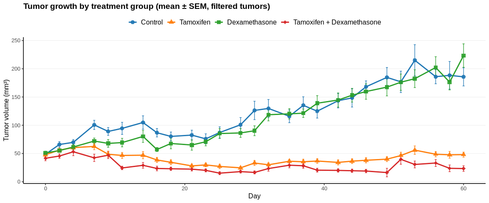
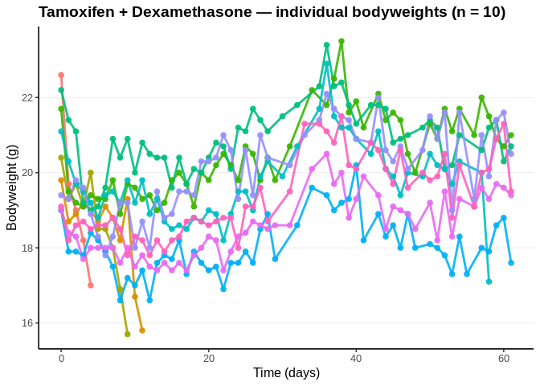
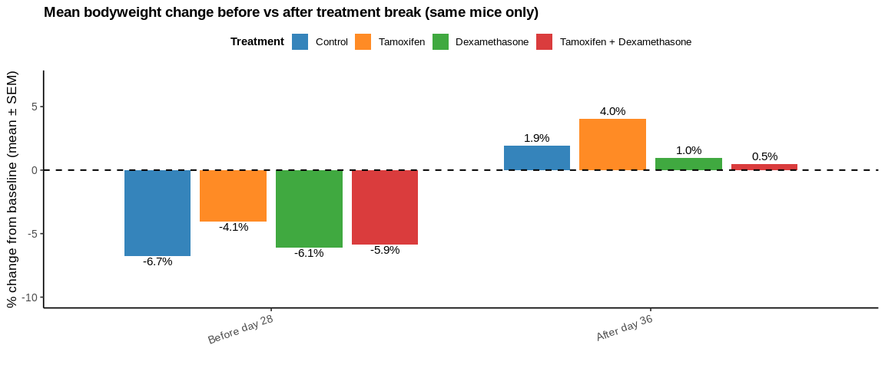

11636_Data analysis
================
Filip Noijons
2025-09-18

- [Setup](#setup)
- [Tumor analysis](#tumor-analysis)
  - [Shared mapping & helpers](#shared-mapping--helpers)
  - [Tumor: data loading](#tumor-data-loading)
  - [Filtering tumors: remove rows with missing tumor
    volumes](#filtering-tumors-remove-rows-with-missing-tumor-volumes)
  - [Tumor growth per group](#tumor-growth-per-group)
  - [Tumor group mean ± SEM (Binned, filtered
    mice)](#tumor-group-mean--sem-binned-filtered-mice)
- [Bodyweight analysis](#bodyweight-analysis)
- [Bodyweight analysis (unfiltered
  mice)](#bodyweight-analysis-unfiltered-mice)
  - [Load bodyweight data](#load-bodyweight-data)
  - [Bodyweight per mouse](#bodyweight-per-mouse)
  - [Bodyweight group mean ± SEM](#bodyweight-group-mean--sem)
  - [Bodyweight change before and after treatment
    break](#bodyweight-change-before-and-after-treatment-break)

# Setup

# Tumor analysis

## Shared mapping & helpers

Group codes in the dataset (e.g. `11636.1`) are translated into clear
treatment group names such as *Control* or *Tamoxifen*.  
A fixed color palette is defined to ensure consistent colors across all
plots. q2

``` r
group_name_map <- c(
  `11636.1` = "Control",
  `11636.2` = "Tamoxifen",
  `11636.3` = "Dexamethasone",
  `11636.4` = "Tamoxifen + Dexamethasone"
)

pal <- c(
  "Control"                   = "#1f77b4",
  "Tamoxifen"                 = "#ff7f0e",
  "Dexamethasone"             = "#2ca02c",
  "Tamoxifen + Dexamethasone" = "#d62728"
)
```

## Tumor: data loading

I imported the tumor measurements per mouse directly from my
pre-processed Excel file.  
Before this step, I already took care of two important things myself:

- **Binning:** I grouped the raw measurements into bins of 1–3 days to
  reduce day-to-day variability while keeping the overall growth
  pattern.  
- **Quality check:** I manually reviewed all measurements and marked
  unreliable values with a `*`. These flagged values are excluded from
  the dataset before analysis. This also means i took out mice with less
  than 30 days within the experiment. Also tumor measurements that didnt
  make sense.

The resulting dataset `mouse_df` therefore already contains clean,
binned tumor volumes with only reliable measurements.  
It includes the following variables:

- `group_name`: treatment group assignment (Control, Tamoxifen,
  Dexamethasone, Combination)  
- `mouse_id`: unique identifier per mouse  
- `day`: binned measurement timepoint (e.g. 0, 1–3, 4–6, …)  
- `volume_mm3`: tumor volume in cubic millimeters

Since I already did the binning and QC, the dataset that is loaded is
directly ready for analysis, and is simply sorted by group, mouse, and
day. The original raw data is still find able called:
`20250623 Catrin Lutz EGP 11636 FINAL iLes export (1).xlsx`

``` r
mouse_df <- readxl::read_excel(tumor_file) %>%
  dplyr::rename_with(tolower) %>%   # make column names lowercase
  dplyr::mutate(
    group_code = as.character(group_code),
    group_name = factor(unname(group_name_map[group_code]), levels = names(pal)),
    day        = as.numeric(day),
    mouse_id   = as.character(mouse_id),
    volume_mm3 = as.numeric(tumor_volume_mm3)
  ) %>%
  dplyr::select(group_code, group_name, mouse_id, day, volume_mm3) %>%
  dplyr::arrange(group_code, mouse_id, day)

knitr::kable(
  head(mouse_df, 20),
  caption = "Preview: tumor per mouse per day",
  format = "markdown"
)
```

| group_code | group_name | mouse_id  | day | volume_mm3 |
|:-----------|:-----------|:----------|----:|-----------:|
| 11636.1    | Control    | 2539021_L |   0 |         NA |
| 11636.1    | Control    | 2539021_L |   2 |         NA |
| 11636.1    | Control    | 2539021_L |   4 |         NA |
| 11636.1    | Control    | 2539021_L |   8 |         NA |
| 11636.1    | Control    | 2539021_R |   0 |         NA |
| 11636.1    | Control    | 2539021_R |   2 |         NA |
| 11636.1    | Control    | 2539021_R |   4 |         NA |
| 11636.1    | Control    | 2539021_R |   8 |         NA |
| 11636.1    | Control    | 2539023_L |   0 |         36 |
| 11636.1    | Control    | 2539023_L |   2 |         59 |
| 11636.1    | Control    | 2539023_L |   4 |         73 |
| 11636.1    | Control    | 2539023_L |   7 |        113 |
| 11636.1    | Control    | 2539023_L |   9 |         87 |
| 11636.1    | Control    | 2539023_L |  11 |         54 |
| 11636.1    | Control    | 2539023_L |  14 |         78 |
| 11636.1    | Control    | 2539023_L |  16 |         65 |
| 11636.1    | Control    | 2539023_L |  18 |         53 |
| 11636.1    | Control    | 2539023_L |  21 |         68 |
| 11636.1    | Control    | 2539023_L |  23 |         89 |
| 11636.1    | Control    | 2539023_L |  25 |         71 |

Preview: tumor per mouse per day

## Filtering tumors: remove rows with missing tumor volumes

I first define a filtered dataset that excludes missing tumor volumes (
that i took out ). This avoids spurious NA rows in tables and plots.

``` r
mouse_df_filtered <- mouse_df %>%
  filter(!is.na(volume_mm3))

knitr::kable(
  head(mouse_df_filtered, 10),
  caption = "Preview: tumor data after filtering out NA tumor volumes",
  format = "markdown"
)
```

| group_code | group_name | mouse_id  | day | volume_mm3 |
|:-----------|:-----------|:----------|----:|-----------:|
| 11636.1    | Control    | 2539023_L |   0 |         36 |
| 11636.1    | Control    | 2539023_L |   2 |         59 |
| 11636.1    | Control    | 2539023_L |   4 |         73 |
| 11636.1    | Control    | 2539023_L |   7 |        113 |
| 11636.1    | Control    | 2539023_L |   9 |         87 |
| 11636.1    | Control    | 2539023_L |  11 |         54 |
| 11636.1    | Control    | 2539023_L |  14 |         78 |
| 11636.1    | Control    | 2539023_L |  16 |         65 |
| 11636.1    | Control    | 2539023_L |  18 |         53 |
| 11636.1    | Control    | 2539023_L |  21 |         68 |

Preview: tumor data after filtering out NA tumor volumes

## Tumor growth per group

Tumor growth is visualized for each tumor individually.  
Within each treatment group, a separate plot is generated.  
This allows assessment of variability within groups.

``` r
# Plot function for each treatment group separately
plot_group_mice <- function(df_group, title_text) {
  ggplot(df_group, aes(x = day, y = volume_mm3, group = mouse_id, color = mouse_id)) +
    geom_line(linewidth = 1, alpha = 0.9) +
    geom_point(size = 2, alpha = 0.9) +
    scale_color_discrete(guide = "none") +
    labs(
      title = title_text,
      x = "Time (days)",
      y = "Tumor volume (mm³)"
    ) +
    theme_classic(base_size = 12) +
    theme(
      plot.title = element_text(face = "bold"),
      panel.grid.major.y = element_line(color = "grey90", linewidth = 0.25),
      panel.grid.minor.y = element_blank()
    )
}

# Loop over treatment groups and make plots
for (g in levels(mouse_df_filtered$group_name)) {
  sub <- filter(mouse_df_filtered, group_name == g)
  
  # Count tumors (L and R separate)
  n_tumors <- n_distinct(sub$mouse_id)
  
  # Count unique mice (ignore L/R suffix)
  n_mice <- n_distinct(gsub("_[LR]$", "", sub$mouse_id))
  
  # Dynamic title
  ttl <- paste0(
    g, " — individual tumor growth (n = ", n_tumors, " tumors; ",
    n_mice, " mice)"
  )
  
  print(plot_group_mice(sub, ttl))
}
```

<!-- --><!-- --><!-- --><!-- -->

## Tumor group mean ± SEM (Binned, filtered mice)

To summarize tumor burden across groups, I calculated the mean tumor
volume ± SEM per treatment group and day. This visualization highlights
differences between treatments while accounting for variability across
tumors. Only the filtered dataset (without NA tumor volumes) is used
here.

``` r
tumor_daily <- mouse_df_filtered %>%
  group_by(group_name, day) %>%
  summarise(
    mean_volume_mm3 = mean(volume_mm3, na.rm = TRUE),
    sem_mm3         = sd(volume_mm3, na.rm = TRUE) / sqrt(n()),
    n_tumors        = n(),
    .groups = "drop"
  ) %>%
  arrange(group_name, day)

ggplot(tumor_daily, aes(x = day, y = mean_volume_mm3,
                        color = group_name, shape = group_name,
                        group = group_name)) +
  geom_errorbar(aes(ymin = mean_volume_mm3 - sem_mm3,
                    ymax = mean_volume_mm3 + sem_mm3),
                width = 0.3, alpha = 0.9) +
  geom_line(linewidth = 1.0) +
  geom_point(size = 3, alpha = 0.9) +
  scale_color_manual(values = pal, breaks = names(pal)) +
  scale_shape_manual(values = c(16, 17, 15, 18), breaks = names(pal)) +  # circle, triangle, square, diamond
  labs(
    title = "Tumor growth by treatment group (mean ± SEM, filtered tumors)",
    x = "Day",
    y = "Tumor volume (mm³)"
  ) +
  theme_classic(base_size = 12) +
  theme(
    legend.position = "top",
    legend.title    = element_blank(),   # remove "Treatment"
    legend.text     = element_text(size = 12),
    legend.key.size = unit(1.2, "lines"),  # bigger symbols
    plot.title      = element_text(face = "bold"),
    panel.grid.major.y = element_line(color = "grey90", linewidth = 0.25),
    panel.grid.minor.y = element_blank()
  )
```

<!-- -->

# Bodyweight analysis

Bodyweight analysis serves as an indicator of potential treatment
toxicity.  
All mice are included in this analysis (even those excluded in tumor
analysis) to avoid bias from selective removal.

# Bodyweight analysis (unfiltered mice)

## Load bodyweight data

``` r
bw_raw <- readxl::read_excel(bw_file, sheet = "Mouse_day_mean")

# Detect correct bodyweight column
bw_candidates <- c("mean_bodyweight_g", "bodyweight_g")
bw_col <- bw_candidates[bw_candidates %in% names(bw_raw)][1]
if (is.na(bw_col)) stop("No bodyweight column found in Mouse_day_mean")

bw_mouse <- bw_raw %>%
  mutate(
    group_code   = as.character(group_code),
    group_name   = factor(unname(group_name_map[group_code]), levels = names(pal)),
    day          = as.numeric(day),
    mouse_id     = as.character(mouse_id),
    bodyweight_g = .data[[bw_col]]
  ) %>%
  filter(group_code %in% names(group_name_map)) %>%
  arrange(group_name, mouse_id, day)

knitr::kable(head(bw_mouse, 8),
             caption="Preview: bodyweight per mouse per day",
             format="markdown")
```

| group_code | group_name | mouse_id | day | bodyweight_g |
|:-----------|:-----------|:---------|----:|-------------:|
| 11636.1    | Control    | 2539021  |   0 |         21.9 |
| 11636.1    | Control    | 2539021  |   1 |         21.6 |
| 11636.1    | Control    | 2539021  |   2 |         21.3 |
| 11636.1    | Control    | 2539021  |   3 |         20.6 |
| 11636.1    | Control    | 2539021  |   4 |         19.8 |
| 11636.1    | Control    | 2539021  |   5 |         19.1 |
| 11636.1    | Control    | 2539021  |   6 |         19.8 |
| 11636.1    | Control    | 2539021  |   7 |         18.5 |

Preview: bodyweight per mouse per day

## Bodyweight per mouse

Bodyweight development is shown for each mouse individually.  
Separate plots per treatment group allow for detailed inspection of
stability or loss of weight over time.

``` r
plot_bw_group <- function(df_group, title_text) {
  ggplot(df_group, aes(x = day, y = bodyweight_g,
                       group = mouse_id, color = mouse_id)) +
    geom_line(linewidth = 1, alpha = 0.9) +
    geom_point(size = 2, alpha = 0.9) +
    scale_color_discrete(guide = "none") +
    labs(
      title = title_text,
      x = "Time (days)",
      y = "Bodyweight (g)"
    ) +
    theme_classic(base_size = 12) +
    theme(
      plot.title = element_text(face = "bold"),
      panel.grid.major.y = element_line(color = "grey90", linewidth = 0.25),
      panel.grid.minor.y = element_blank()
    )
}

for (g in levels(bw_mouse$group_name)) {
  sub <- filter(bw_mouse, group_name == g)
  n_m <- n_distinct(sub$mouse_id)
  ttl <- paste0(g, " — individual bodyweights (n = ", n_m, ")")
  print(plot_bw_group(sub, ttl))
}
```

<!-- --><!-- --><!-- --><!-- -->

## Bodyweight group mean ± SEM

To summarize bodyweight development across groups, I calculated the mean
bodyweight ± SEM per treatment group and day. To avoid bias from less
measurments in a day, I excluded all days with fewer than 7 individual
mouse measurements. This ensures that the plotted averages are based on
sufficient observations and reflect reliable group-level trends.

``` r
bw_daily <- bw_mouse %>%
  group_by(group_name, day) %>%
  summarise(
    mean_bw = mean(bodyweight_g, na.rm = TRUE),
    sem_bw  = sd(bodyweight_g, na.rm = TRUE) / sqrt(n()),  # SEM
    n       = n(),
    .groups = "drop"
  ) %>%
  filter(n >= 7) %>%   # keep only days with ≥ 7 mice measured
  arrange(group_name, day)

ggplot(bw_daily, aes(x = day, y = mean_bw,
                     color = group_name, group = group_name, shape = group_name)) +
  geom_errorbar(aes(ymin = mean_bw - sem_bw, ymax = mean_bw + sem_bw),
                width = 0.3, alpha = 0.9) +
  geom_line(linewidth = 1.0) +
  geom_point(size = 2.6) +
  scale_color_manual(values = pal, breaks = names(pal), name = "Treatment") +
  scale_shape_manual(values = c(16, 17, 15, 18), name = "Treatment") +
  labs(
    title = "Bodyweight development by treatment group (mean ± SEM, days with ≥ 7 mice)",
    x = "Day",
    y = "Bodyweight (g)"
  ) +
  theme_classic(base_size = 12) +
  theme(
    legend.position = "top",
    legend.title    = element_text(size = 11, face = "bold"),
    legend.text     = element_text(size = 10),
    plot.title      = element_text(face = "bold"),
    panel.grid.major.y = element_line(color = "grey90", linewidth = 0.25),
    panel.grid.minor.y = element_blank()
  )
```

<!-- -->

## Bodyweight change before and after treatment break

To assess the impact of the treatment break on bodyweight, I compared
the percentage change from baseline bodyweight before the break (days
0–27) and after recovery (days ≥36). For each mouse, the relative change
compared to its baseline (day 0) was calculated, and then averaged
within treatment groups. The resulting bar plot shows the mean
bodyweight change ± SEM per group, highlighting both the weight loss
observed during treatment and the partial recovery after treatment was
paused. The number of mice contributing to each estimate is shown above
the bars.

``` r
## Bodyweight change before vs after treatment break (same mice only)

# Calculate % change from baseline
baseline_bw <- bw_mouse %>%
  group_by(mouse_id) %>%
  summarise(baseline = first(bodyweight_g), .groups = "drop")

bw_pct <- bw_mouse %>%
  left_join(baseline_bw, by = "mouse_id") %>%
  mutate(pct_change = 100 * (bodyweight_g - baseline) / baseline)

# Restrict to mice with measurements in both periods (before 28, after 36)
valid_mice <- bw_pct %>%
  group_by(mouse_id) %>%
  summarise(
    has_before = any(day < 28, na.rm = TRUE),
    has_after  = any(day >= 36, na.rm = TRUE),
    .groups = "drop"
  ) %>%
  filter(has_before & has_after) %>%
  pull(mouse_id)

bw_pct_complete <- bw_pct %>%
  filter(mouse_id %in% valid_mice)

# Summarize means for before and after (exclude break window 28–35)
bw_summary <- bw_pct_complete %>%
  mutate(period = case_when(
    day < 28 ~ "Before day 28",
    day >= 36 ~ "After day 36",
    TRUE ~ NA_character_
  )) %>%
  filter(!is.na(period)) %>%
  group_by(group_name, period, mouse_id) %>%
  summarise(mean_change = mean(pct_change, na.rm = TRUE), .groups = "drop") %>%
  group_by(group_name, period) %>%
  summarise(
    mean_change = mean(mean_change, na.rm = TRUE),
    sem_change  = sd(mean_change, na.rm = TRUE) / sqrt(n()),
    n_mice      = n(),
    .groups = "drop"
  ) %>%
  mutate(period = factor(period, levels = c("Before day 28", "After day 36")))

# Plot with baseline at 0% and normal % labels
ggplot(bw_summary, aes(x = period, y = mean_change, fill = group_name)) +
  geom_col(position = position_dodge(width = 0.8), width = 0.7, alpha = 0.9) +
  geom_errorbar(aes(ymin = mean_change - sem_change,
                    ymax = mean_change + sem_change),
                width = 0.2,
                position = position_dodge(width = 0.8)) +
  geom_hline(yintercept = 0, linetype = "dashed", color = "black", linewidth = 0.7) +
  geom_text(aes(label = sprintf("%.1f%%", mean_change)),
            position = position_dodge(width = 0.8),
            vjust = ifelse(bw_summary$mean_change >= 0, -0.5, 1.2),
            size = 4) +
  scale_fill_manual(values = pal, name = "Treatment") +
  labs(
    title = "Mean bodyweight change before vs after treatment break (same mice only)",
    x = "",
    y = "% change from baseline (mean ± SEM)"
  ) +
  expand_limits(y = c(-10, 7)) +   # extend Y-axis so labels aren’t cut off
  theme_classic(base_size = 13) +
  theme(
    legend.position = "top",
    legend.title    = element_text(size = 11, face = "bold"),
    legend.text     = element_text(size = 10),
    plot.title      = element_text(face = "bold", size = 14),
    axis.text.x     = element_text(angle = 20, hjust = 1)
  )
```

<!-- -->
